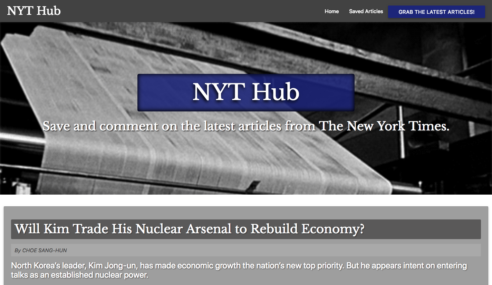

# NYT Hub
__This web application utilizes MongoDB, Node.js, and Cheerio to scrape the latest news articles from The New York Times and allows users to view and save each article.__

### Overview
* Whenever a user visits NYT Hub, the user can click the "Get New Articles" button, and the app will scrape the latest stories from the New York Times and display them for the user. 
    * Each scraped article is saved to the application database.
    * The app scrapes and displays the following information for each article:
        * __Headline__ - _the title of the article_
        * __Summary__ - _a short summary of the article_
        * __URL__ - _the url to the original article_

* Next to each article is a "Save Article" button for which the user can click to save the article for later viewing. 
    * When the user clicks the "Saved Articles" button, the user will view all of the articles that have been saved. 

* Next to each saved article, there is a "Delete" button and an "Article Notes" button.
    * "Delete" will delete the article from the saved section.
    <!-- * "Article Notes" allows the user to view all of the user-created comments on the selected article. -->

<!-- * The "Article Notes" button also allows users leave a comment on the selected article. 
    * The comments are saved to the database and associated with their articles. 
    * Users are able to delete comments left on the articles. 
    * All stored comments are visible to every user. -->

> __NOTE__: Whenever a user saves an article, the app ensures that the selected article isn't already represented the database before saving it so there are no duplicates.

#### This application utilizes the following npm packages:
* _express_ 
* _express-handlebars_
* _mongoose_
* _body-parser_
* _cheerio_
* _request_

<!-- #### > Deployed Site: https://fathomless-anchorage-80269.herokuapp.com/ -->

#### > __Try it Out:__

